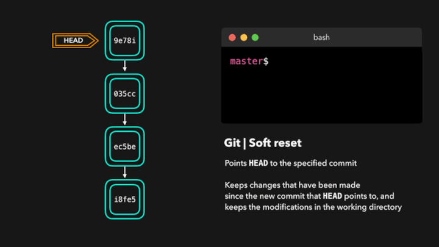
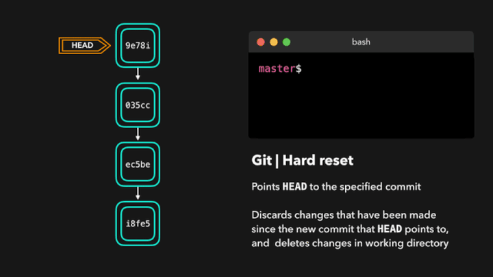

## 1.restore

``` bash
$ git restore (--worktree) <filename>   # (默认参数) 撤销文件在工作区的修改
$ git restore --staged <filename>       # 撤销文件在暂存区的修改
$ git restore -s HEAD~1 <filename>      # 将当前工作区的文件切换到上个 commit 版本
$ git restore -s <commit_id> <filename> # 将当前工作区的文件切换到指定 commit 版本
```

::: warning
`$ git restore <filename>` 会将工作区内尚未 add 的修改全部撤销，请谨慎操作！
:::

<br></br>

## 2.revert

`$ git revert` 通过对特定的提交执行还原操作，这将会创建一个包含已还原修改的新提交。

<center></img></center>

<br></br>

## 3.reset

### 软重置

---

`$ git reset (--soft) <commit_id>` 或用 `HEAD~<number>` 默认参数带的是软重置，软重置会将 HEAD 移至指定的提交（或与 HEAD 相对的提交的索引），而不会移除该提交之后加入的修改！因而执行完该操作后，会提醒有 "uncommitted changes"。

<center></img></center>

<br></br>

### 硬重置

---

`$ git reset --hard <commit_id>` 或用 `HEAD~<number>` 有时候我们并不想保留特定提交引入的修改。不同于软重置，我们应该再也无需访问它们。Git 应该直接将整体状态直接重置到特定提交之前的状态：这甚至包括你在工作目录中和暂存文件上的修改。即丢弃了重置 "commit_id" 之后的所有提交中的所有修改。

<center></img></center>
