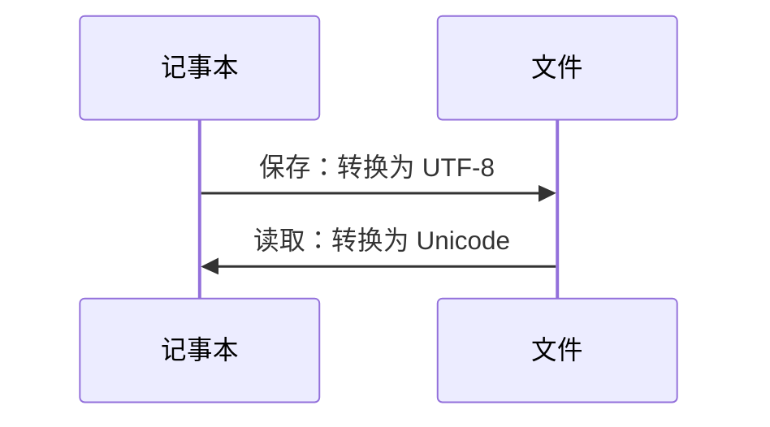

## 1.1.数据类型

**整数**

- 多个 0 的整数可以用下划线 `_` 分割：`10_000_000`
- `0x` 前缀表示十六进制数：`0xff5a`；同样也可以用 `_` 分割十六进制数：`0xa1b2_c3d4`
- Python 的整数也没有大小限制

**浮点数**

- 主要注意科学计数法：`1.23e9` 与 `12.3e8` 是等价的
- Python 的浮点数也没有大小限制，但是超出一定范围就表示为 `inf` (无穷大)

**字符串**

- 单双引号的区别和用法：`"The book 'ABC' is good."`, `'The book "ABC" is good.'`, `"The book \"ABC\" is good."`, `'The book \'ABC\' is good.'`
- 转义字符 -- [汇总链接](https://www.runoob.com/python/python-strings.html)
- 字符串前加上 `r` 不转义：`r'A\nB'` 的输出为 `A\nB`

**布尔值**

- `True` 和 `False`
- `not`, `or`, `and` 运算符

**空值**

- `None`，区别于 `0`

**变量**

- Python 中变量的数据类型是不固定的，因而称之为“动态语言”

**常量**

- Python 中常用全部大写的变量名来表示常量：`PI = 3.14159265359`

**补充**

- 除法： `10 / 3 = 3.3333333333333335`
- 地板除：`10 // 3 = 3`
- 取余：`10 % 3 = 1`

<br />

## 1.2.编码和字符串

**编码**

- 编码的简明历史：`ASCII` (乱码) --> [`Unicode`](https://zh.wikipedia.org/zh-cn/Unicode) (占传输和存储空间) --> [`UTF-8`](https://zh.wikipedia.org/zh-cn/UTF-8) (可变长)
- 计算机内存中，统一使用 Unicode 编码，保存和传输时为 UTF-8 编码



<br />


<br />

**字符串**

- `ord()` 获取字符的整数表示，`chr()` 把编码转换为对应的字符

- 字符串格式化的 3 种方法 -- [格式化符号汇总](https://www.runoob.com/python/python-strings.html)

```python
# 方法 1. %
>>> print('%2d-%02d' % (3, 1))
3-01
>>> 'Age: %s. Gender: %s' % (25, True)  # 不确定用什么占位符的时候，%s 会把任何类型的数据转为字符串
'Age: 25. Gender: True'

# 方法 2. format()
>>> 'Hello, {0}, 成绩提升了 {1:.1f}%'.format('小明', 17.125)
'Hello, 小明, 成绩提升了 17.1%'

# 方法 3. f-string
>>> r = 2.5
>>> s = 3.14 * r ** 2
>>> print(f'The area of a circle with radius {r} is {s:.2f}')
The area of a circle with radius 2.5 is 19.62

# 小结
>>> s1 = 72
>>> s2 = 85
>>> r = 100 * (s2 - s1) / s1 
>>> print('%.1f %%' % r)  # %% 来表示一个 %
18.1 %
>>> print('{0:.1f} %'.format(r))
18.1 %
>>> print(f'{r:.1f} %')
18.1 %
```

- 三引号：保证所见即所得，不用费神于引号和特殊字符串，一个典型的用例就是，引入 HTML 或是 SQL 代码块时用三引号标记

- 编解码：`'ABC'` 和 `b'ABC'` 不一样，前者时 `str`，后者是 `bytes`

```python
# 编码
>>> 'ABC'.encode('ascii')
b'ABC'
>>> '中文'.encode('utf-8')
b'\xe4\xb8\xad\xe6\x96\x87'
>>> '中文'.encode('ascii')
Traceback (most recent call last):
  File "<stdin>", line 1, in <module>
UnicodeEncodeError: 'ascii' codec can't encode characters in position 0-1: ordinal not in range(128)

# 解码
>>> b'ABC'.decode('ascii')
'ABC'
>>> b'\xe4\xb8\xad\xe6\x96\x87'.decode('utf-8')
'中文'

# 统计字符串 or 字节的长度
>>> len('ABC')
3
>>> len('中文')
2

>>> len(b'ABC')
3
>>> len(b'\xe4\xb8\xad\xe6\x96\x87')
6
>>> len('中文'.encode('utf-8'))
6
```

- 编解码开头声明

```python 
#!/usr/bin/env python3
# -*- coding: utf-8 -*-
```

- 字符串的方法和属性以及字符串操作的汇总 -- [Python 字符串内建函数大全](https://www.runoob.com/python/python-strings.html)

```python
# ========================================== 操作部分 ========================================== 
# 1.连接操作
>>> 'abc' + '123' + 'def'               # 连接较少字符串时推荐使用
'abc123def'
>>> '-'.join(['abc', '123', 'def'])     # 连接较多字符串时推荐使用
 'abc-123-def'
>>> '%s%s%s' % ('abc', '123', 'def')
'abc123def'

# 2.索引和切片
>>> a = '123456789'
>>> a[6]        # 单个索引
'7'
>>> a[-2]       # 负索引
'8'
>>> a[1:5]      # 切片，[1, 5) 左闭右开，默认步长为 1
'2345'
>>> a[7:]       # 切片，从 7 到最后全部
'89'
>>> a[1:5:2]    # 改变步长
'24'
>>> a[5:1:-2]   # 反方向切片，**在反转字符串顺序时常用到，可以写成 `a[::-1]`**
'64'
>>> a[0:-3]     # 含负索引的切片
'123456'
>>> a[-4:1:-2]  # 负索引、反方向、改变步长
'64'

# 3.字符串成员运算符
>>> 'a' in 'abc'
True
>>> 'a' not in 'abc'
False

# 4.重复输出字符串
>>> 'love' * 2
'lovelove'


# ========================================== 内建方法 ========================================== 
# 方法特别多，这里不全部介绍，详见参考 https://www.runoob.com/python/python-strings.html
# 个人按照以下几个方面分类，并举例常用的方法

# 1.操作字符串
>>> 'abc'.capitalize()              # 字符串首字母大写
'Abc'

>>> '&'.join(['a', 'b', 'c'])       # 字符串连接
'a&b&c'

>>> 'a&b&c'.split(' ', 1)           # 字符串分割
['a', 'b&c']

>>> 'I love you'.partition('love')  # 字符串拆分
('I ', 'love', ' you')

>>> '1 and 3'.replace('3', '2')     # 字符串替换
'1 and 2'

>>> '  abc   '.strip()              # 去除字符串首尾的所有空格
'abc'


# 2.判断字符串
>>> 'abc'.startswith('ab')          # 是否以指定字符串开头
True

>>> 'abc123'.isalnum()              # 是否含字母或数字 
True

>>> 'abc'.isupper()                 # 是否都是大写
False


# 3.排版字符串 (这部分的效果也可以用占位符实现)
>>> 'A is {0:.2f}'.format(1.2345)
'A is 1.23'

>>> 'abc'.ljust(5)
'abc  '

>>> '123'.zfill(6)
'000123'


# 4.查找字符串
>>> 'aaabcd'.count('aa')            # 统计指定字符串出现的次数
1

>>> 'aaabcd'.find('bc')             # 如果包含指定字符串，返回开始的索引值，否则返回 -1
3


# 5.其他
>>> max('AbcDKIO')                  # 返回最大的字母
'c'
# 还有一个 translate() 函数方法，多与 maketrans() 配合使用；
# 个人认为这个方法是 replace 的加强版，可以替换多个字符串
```

- 排版输出

```python
>>> '{0:=^7.2f}'.format(3.14159265359)
'=3.14=='

>>> '{0:0<7.2f}'.format(3.14159265359)
'3.14000'

>>> '{0:x>7.2f}'.format(3.14159265359)
'xxx3.14'
```

<br />

## 1.3.四大容器

### 1.3.1.列表 list

- 列表是一种有序的集合，可以随时添加和删除其中的元素
- 列表中的元素可以是不同的数据类型：`['abcd', 123, True]`
- 列表的索引和切片操作和字符串一样（但与字符串不一样的是，列表可以直接索引赋值 `a_list[1] = 134`）
- 内建函数 (**注意：内建函数很多都是原地操作的函数方法，即会改变原列表中的内容**)

```python
# append
>>> number = [1, 2, 3, 4, 5]
>>> number.append(6)
>>> number
[1, 2, 3, 4, 5, 6]

# pop
>>> name = ['kebi', 'xinye', 'maoxian', 'xiaoniao']
>>> name.pop()
'xiaoniao'
>>> name
['kebi', 'xinye', 'maoxian']
>>> name.pop(1)
'xinye'
>>> name
['kebi', 'maoxian']

# insert
>>> name = ['kebi', 'maoxian', 'xiaoniao']
>>> name.insert(1, 'xinye')
>>> name
['kebi', 'xinye', 'maoxian', 'xiaoniao']

# remove
>>> name = ['kebi', 'maoxian', 'xinye', 'xiaoniao', 'xinye', 'maoxian']
>>> name.remove('maoxian')
>>> name
['kebi', 'xinye', 'xiaoniao', 'xinye', 'maoxian']

# count
>>> number = [1, 2, 3, 1, 1, 2, 4]
>>> number.count(1)
3
>>> number.count(4)
1

# reverse
>>> a = ['abc', 123, True, 4.51]
>>> a.reverse()
>>> a
[4.51, True, 123, 'abc']

# sort
>>> number = [4, 2, 1, 5, 9]
>>> number.sort()
>>> number
[1, 2, 4, 5, 9]
>>> number.sort(reverse=True)
>>> number
[9, 5, 4, 2, 1]

# extend
>>> num1 = [1, 2, 3]
>>> num2 = [5, 6, 7]
>>> num1.extend(num2)
>>> num1
[1, 2, 3, 5, 6, 7]

# index
>>> num = [1, 2, 3, 5, 6, 7, 5, 6, 7]
>>> num.index(7)
5
```

### 1.3.2.元组 tuple

- 元组和列表很相似，其切片和索引操作一致，但是元组一旦初始化后，其内部元素无法修改 (由于其不可变性，常用于坐标等场景下)
- 陷阱1：
  - `()` 是空元组
  - `(1)` 是整数 1
  - `(1,)` 是只含一个元素即整数 1 的元组
- 陷阱2：`a_tuple = (1, 2, [True, 'abc', 234])` 其中的第 2 个元素，即列表 `[True, 'abc', 234]` 是可以修改的

### 1.3.3.字典 dict


### 1.3.4.集合 set


### 1.3.5.题外话

- 不可变对象

<br />

## 1.4.一些常用的内建函数

- `reversed()`
- `sorted()`
- `enumerate()`
- `zip()`
