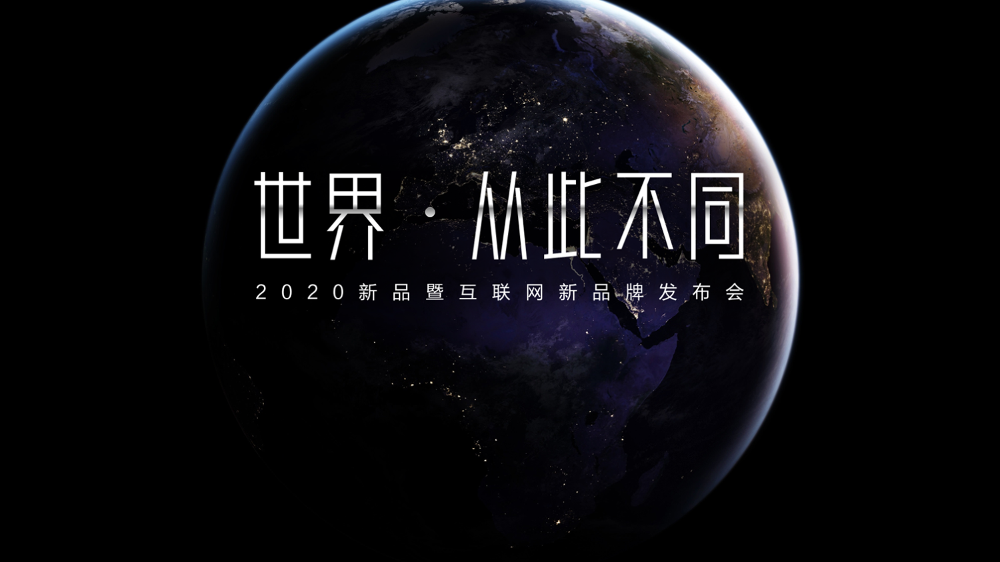
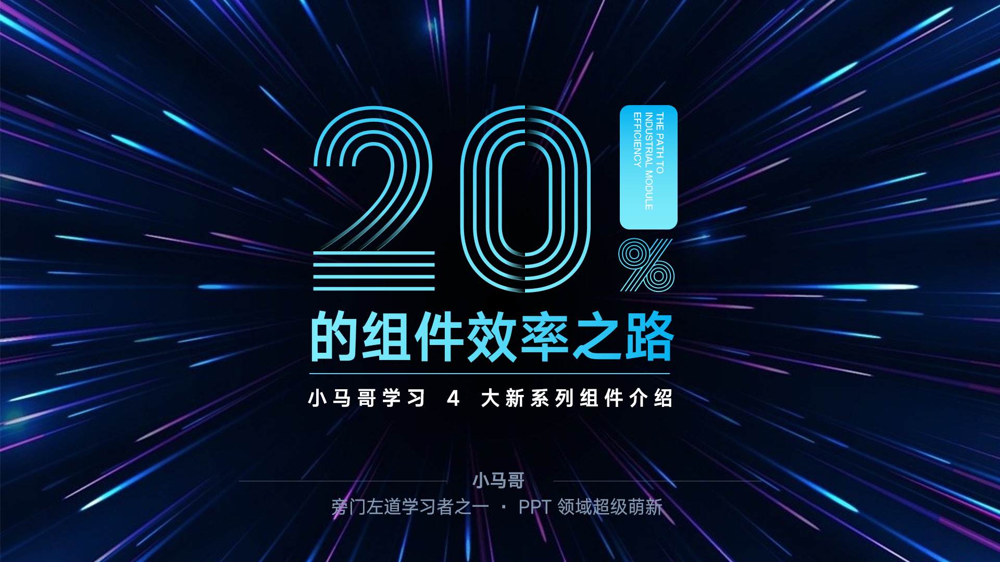
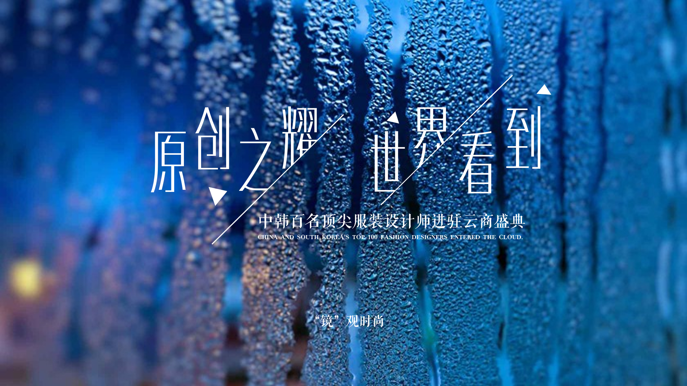

# 第一季：封面页

## 01.蓝色科技感封面设计

- 设计元素：错开的文字、线条
- 渐变色：色块、线条
- 蒙版弱化背景图片，突出文字

  

## 02.金属质感动态背景封面练习

- 设计元素：金属感文字，关键在于渐变光圈的设置，得多看多实践
- 同样用蒙版减少背景图片对于文字的干扰
- `动画` ▸ `强调` ▸ `放大/缩小`

  

## 03.阴影字效果

- Prism 这个神奇的线条字体
- 关键是布尔运算中的**相交**（注意选中图形的先后顺序）
- 还是利用了渐变色
- 配色，配色，还是配色！

  

## 04.时尚封面

- 简单线条与三角形构造出的高级感
- `形状设置格式` ▸ `填充` ▸ `幻灯片背景填充` :zap:

